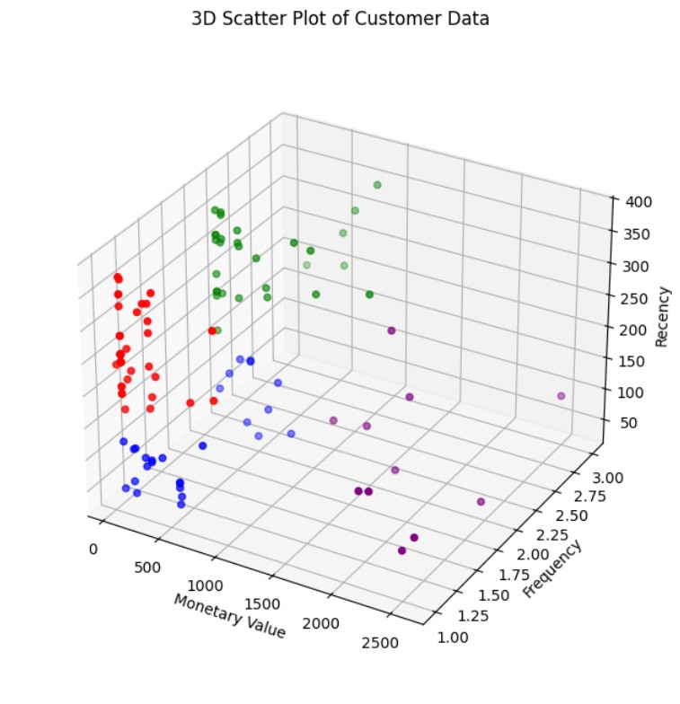

<h1 align="center" > 
  <b>Customer Segmentation</b>
</h1>
<h3 align="center">A Strategic Analysis for a Service-Based Business</h3>

## **Project Overview**

This project analyzes one year of real-world transactional data from a service-based business in order to identify distinct customer segments. I apply robust data engineering, statistical analysis, and **K-Means clustering** to provide the business owner an actionable framework. With this analysis, the owner can understand their diverse client base, optimize marketing efforts, and boost client retention and revenue growth.

## **Table of Contents**
* [1. Data Source & Key Challenges](#1-data-source--key-challenges)
* [2. Methodology](#2-methodology)
* [3. Key Findings: Customer Segments](#3-key-findings-customer-segments)
  * [3.1. Core Customer Segments](#31-core-customer-segments)
  * [3.2. Outlier Segments](#32-outlier-segments)
* [4. Actionable Recommendations](#4-actionable-recommendations)
* [5. Technologies Used](#5-technologies-used)
* [6. Project Structure](#6-project-structure)
* [7. Future Work](#7-future-work)

---

## **1. Data Source & Key Challenges**

The dataset consists of a raw bookkeeping ledger exported from the business's accounting software, encompassing approximately **2342** rows of transaction data over a 12-month period. This raw data presented several common, yet significant, real-world data challenges:

* **Unstructured Format:** The data was not a flat tabular file but a concatenated report with distinct sections (e.g., `!CUST` master list, `!TRNS` transaction ledger) and used ledger markers like `TRNS`, `SPL`, and `ENDTRNS` for multi-row transaction blocks.

* **Data Quality Issues:** I encountered missing values, negative monetary amounts, ambiguous string formats for client names and services, and varying column structures across different report sections.

* **Privacy:** The dataset contained Personally Identifiable Information (PII) that required careful anonymization to ensure the business and its data stays anonymous.

## **2. Methodology**

I followed a methodical data science workflow to transform the raw, complex data into actionable insights:

> 1.  **Anonymization & PII Handling:** I developed a process to replace real client names and specific service descriptions with anonymous IDs and standardized labels, ensuring data privacy and compliance. I also rounded monetary values to prevent exact re-identification.

> 2.  **Data Engineering & Structuring:** I parsed the non-tabular ledger data, structuring its distinct sections (e.g. `!CUST` for customer master, `!TRNS` for transactions) into clean, tabular DataFrames.

> 3.  **Data Cleaning & Preprocessing:** I cleaned the data by handling missing values, standardizing data types (dates, amounts), and extracting invoice IDs.

> 4.  **Feature Engineering:** I created a customer-centric DataFrame by aggregating transactional data to calculate core **RFM (Recency, Frequency, Monetary)** metrics for each unique client.

> 5.  **Explorational Data Analysis (EDA):** I visualized the distributions and relationships of the RFM features to identify and handle outliers by separating them for their own analysis. This provided the initial insights into typically customer behavior.

> 6.  **Clustering:** I applied the K-Means algorithm to the scaled RFM data. I evaluated the optimal number of clusters (`k`) using both the **Elbow Method** with inertia and the **Silhouette Score** for conclusive segmentation.

> 7.  **Profiling & Interpretation:** I analyzed the statistical profiles of each cluster, creating clear, business-focused customer personas.

> 8.  **Outlier Analysis:** I conducted a dedicated analysis of outlier customers (e.g., those with exceptionally high spend or frequency) to identify distinct high-value or unique segments.

## **3. Key Findings: Customer Segments**

The analysis successfully identified four core customer segments, as well as several important outlier segments, each with a unique profile and associated business opportunities.

### **3.1. Core Customer Segments**

These are the primary groups making up the majority of the customer base:

| Cluster | Persona Name | Median Recency (Days) | Median Frequency (Count) | Median MonetaryValue ($) | Description |
| :------ | :----------- | :--------------------: | :------------------------: | :-----------------------: | :----------------------------------------------------------------------------------------------------------------------------------------------------------------------- |
| **0** | **Retain** | **315.5** | **2** | **262.5** | Lapsed customers, high Recency and low Frequency, but have made more than one purchase in the past. |
| **1** | **Reward** | **105** | **2** | **2125** | Highest-value, purchasing frequently and spending a large amount. Most loyal and active clients. |
| **2** | **Re-Engage** | **261** | **2** | **90** | Lapsed customers, inactive for a long time, low to mid-range spend, indicating they have become dormant. |
| **3** | **Nurture** | **97** | **1** | **395** | New to the business, recent, typically one-time purchasers. Represents future potential. |

### **3.2. Outlier Segments**

Beyond the core clusters, I identified and profiled key outlier segments:

| Cluster | Persona Name | Median MonetaryValue ($) | Median Frequency (Count) | Description |
| :------ | :----------- | :----------------------- | :------------------------ | :---------- |
| **-3** | **Appreciate** | Extremely High | Extremely High | Most valuable outliers; top-tier clients with both highest spend and frequency. |
| **-2** | **Upsell** | Lower/Mid-Range | Very High | Active and frequent purchasers, but with lower spend per purchase. |
| **-1** | **Spoil** | High | Infrequent | High-value clients who spend a lot but purchase rarely. |

## **4. Actionable Recommendations**

Based on the identified segments, I provide the following actionable recommendations to the business owner to optimize client engagement and maximize revenue:

* **For "Retain" Clients:** Focus on personalized outreach to understand their changing needs and offer a discount on their next purchase.

* **For "Reward" Clients:** Implement a VIP loyalty program with exclusive offers and early access to new services to maximize their lifetime value and encourage referrals.

* **For "Re-Engage" Clients:** Launch a re-engagement campaign with compelling "welcome back" offers or personalized outreach to reactivate dormant relationships.

* **For "Nurture" Clients:** Design targeted onboarding and follow-up campaigns to encourage a second purchase, building early loyalty.

* **For Outlier Segments (Appreciate, Upsell, Spoil):** Tailor ultra-specific strategies, such as dedicated account management for 'Appreciate', bundle deals for 'Upsell', and luxury service promotions for 'Spoil'.

## **5. Technologies Used**

* **Python 3**
* **Pandas:** For data manipulation, structuring, and aggregation.
* **Scikit-learn:** For K-Means clustering and feature scaling (`StandardScaler`).
* **Matplotlib & Seaborn:** For data visualization and exploratory analysis.

## **8. Future Work**

This project establishes a foundation for further analytics. Potential next steps include:

* **Customer Lifetime Value (CLTV) Prediction:** Building a predictive model to forecast the total revenue a customer will generate over a defined period.
* **Time Series Forecasting:** Predicting future booking demand or revenue trends based on historical data.

---

**Author:** Thatcher McClure

**Contact Me:** thatchermcclure@gmail.com